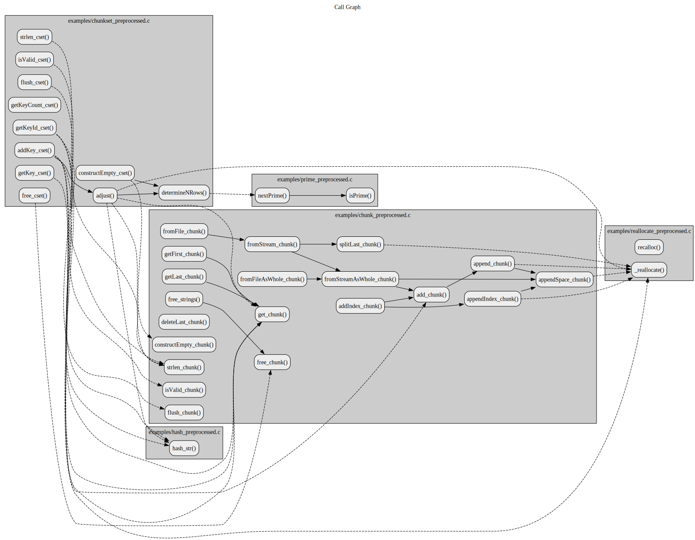

# srcMetrics:

## Table of Contents

* [Get Started](#get-started)
    - [Calculate Metrics](#calculate-metrics)
    - [Compute a Call Graph](#compute-a-call-graph)
    - [Compute Control Flow Graphs](#compute-control-flow-graphs)
    - [Compute Everything](#compute-everything)
* [When to Use Preprocessed Source Files](#when-to-use-preprocessed-source-files)
* [I Use Preprocessed Files but Still Get Errors](#i-use-preprocessed-files-but-still-get-errors)
* [Function Pointers](#function-pointers)
* [Custom Metrics](#custom-metrics)
* [Tested Systems](#tested-systems)
* [Test Coverage](#test-coverage)
* [Copyright](#copyright)

## Get Started

Open a terminal and clone this repository using the following command:

```
git clone https://github.com/srcML/srcMetrics.git
```

Change the directory to the repository:

```
cd srcMetrics
``` 

Now, build the `bin/srcMetrics` executable:

* **WARNING**: M1/M2 Mac users, please use Rosetta Mode for `libsrcml` and `libsrcsax` compatibility.
* **WARNING**: `libsrcml` and `libsrcsax` must be installed before building `bin/srcmetrics`.
* **WARNING**: In the [Makefile](Makefile), the compiler is set to `CC=clang`. See the commented values to use `gcc`.

```
make
```

Now, you are ready to use `srcmetrics`:

```
bin/srcmetrics
```

The command above shows the typical uses of `srcmetrics`. The following subsections describe these uses.

### Calculate Metrics

You can show the list of all supported metrics as follows:

```
bin/srcmetrics -L
```

Use the following command to output `SLOC` and `MC` metrics for `examples/prime_preprocessed.c` to the standard output:

```
bin/srcMetrics -m SLOC -m MC examples/prime_preprocessed.c
```

The above command should produce the following output:

```
1  MC_examples/prime_preprocessed.c,2
2  MC,2
3  SLOC_examples/prime_preprocessed.c::isPrime(),8
4  SLOC_examples/prime_preprocessed.c::nextPrime(),4
5  SLOC_examples/prime_preprocessed.c,14
6  SLOC,14
```

Here, the first line shows the `MC` metric for `examples/prime_preprocessed.c`. The second line shows the total `MC` metric for all source files. In this example, there is only one source file, so the first and second values are equal.

The third line shows the `SLOC` metric for the `isPrime()` function located in `examplse/prime_preprocessed.c`. Notice that depending on the type of metric, the output may or may not contain values per function.

The following command outputs all metrics for several source files:

```
bin/srcmetrics examples/*.c
```

You can also save the output to a Comma-Separated Values (CSV) file as follows:

```
bin/srcmetrics examples/*.c -o metrics.csv
```

Finally, you can use the following command to output all metrics excluding the `SLOC` metric:

```
bin/srcmetrics -e SLOC examples/*.c
```

### Compute a Call Graph

Execute the following command to output the call graph of several source files:

```
bin/srcmetrics --cg examples/cg examples/*.c
```

The above command should produce two graph files:

* `examples/cg.dot` and
* `examples/cg.xml`.

If you have [Graphviz](https://graphviz.org) installed, you can use the following command to produce an image of the call graph:

```
dot -Tsvg examples/cg.dot > examples/cg.svg
```

This call graph should look as follows:



In the graph, notice that some function calls are solid and the others are **dashed**. Since `srcmetrics` is NOT a compiler, whenever the caller and the callee functions are in separate units, the true target of the call is just a guess. Therefore, we denote such guess-based calls with dashed lines.

### Compute Control Flow Graphs

Use the following command to output the control flow graph:

```
bin/srcmetrics --cfg examples/cfg examples/*.c
```

### Compute Everything

Use the following command to output everything:

```
bin/srcmetrics --cg examples/cg --cfg examples/cfg --ipcfg examples/ipcfg -a examples/*.c
```

## When to Use Preprocessed Source Files

`srcmetrics` can calculate all non-graph based metrics from raw C source code files, accurately. However, **C preprocessor macros** can hide function calls and multiple C statements in them, disrupting CG/CFG generation. For example:

```
#define UNTIL(condition) while(!(condition))
```

will hide the `while` control-flow and show something like `UNTIL(n==0) n--;` as one simple statement.

To compute CG and CFGs accurately, you must first preprocess all the macros in the source files.

You can use the commands below to generate the files in the `examples/` directory:

```
cc -E -P -Iinclude -imacros util/hash.h src/util/hash.c > examples/hash_preprocessed.c
```

```
cc -E -P -Iinclude             \
    -imacros ctype.h           \
    -imacros stdlib.h          \
    -imacros stdint.h          \
    -imacros string.h          \
    -imacros util/chunk.h      \
    -imacros util/reallocate.h \
    src/util/chunk.c > examples/chunk_preprocessed.c
```

```
cc -E -P -Iinclude             \
    -imacros stdlib.h          \
    -imacros string.h          \
    -imacros util/chunkset.h   \
    -imacros util/hash.h       \
    -imacros util/prime.h      \
    -imacros util/reallocate.h \
    -imacros util/streq.h		\
    src/util/chunkset.c > examples/chunkset_preprocessed.c
```

```
cc -E -P -Iinclude -imacros util/prime.h src/util/prime.c > examples/prime_preprocessed.c
```

```
cc -E -P -Iinclude             \
    -imacros string.h          \
    -imacros util/reallocate.h \
    src/util/reallocate.c > examples/reallocate_preprocessed.c
```

**NOTE**: `cc` could be `clang` or `gcc`.

## I Use Preprocessed Files but Still Get Errors

`srcmetrics` may NOT support C functionality beyond the C standard. For example, look at the contents of [tests/foobar.c.nested](tests/foobar.c.nested):

```
int foo(void) {
    int bar(void) {
        return 3;
    }

    return bar();
}
```

`gcc` compiles the above code but nested functions are NOT allowed in the C standard.

## Function Pointers

`srcmetrics` does NOT support data-flow analysis. So, it will think the function pointer is NOT a function pointer but a real external function that is just not defined in any of the given source files.

For example, look at the contents of [tests/foobar_fnptr.c](tests/foobar_fnptr.c). Here, `bar_fnptr` is NOT an external function but the call graph shows it as one.


**NOTE**: We still show the call with a **dashed** arrow because we assume it is an external function but it could be a function pointer.

**NOTE**: Use the following command to generate the call graph:

```
bin/srcmetrics --cg-show-external --cg tests/foobar_fnptr.cg tests/foobar_fnptr.c
```

## Custom Metrics

It is possible to add custom metrics. This section shows how to add `NC: Number of Comments`.

First, open [include/srcmetrics/metrics.h](include/srcmetrics/metrics.h). Here, you should see two macros; `METRICS` and `METRIC_DESCRIPTIONS`. Add the new metric and its description to these macros as follows:

```
    #define METRICS {                                                           \
        "ABC",                                                                  \
        "AMS",                                                                  \
        "CC",                                                                   \
        "HSM",                                                                  \
        "MC",                                                                   \
        "MND",                                                                  \
        "NPM",                                                                  \
        "RFU",                                                                  \
        "SLOC",                                                                 \
        "NC",                                                                   \
        NULL                                                                    \
    }
    #define METRIC_DESCRIPTIONS {                                               \
        "√(A²+B²+C²), where\n"                                                  \
            "        A: Assignments,\n"                                         \
            "        B: Branches,\n"                                            \
            "        C: Conditionals",                                          \
        "Average Method Size",                                                  \
        "Cyclomatic Complexity (needs Control-Flow Graph)",                     \
        "Halstead Software Metrics;\n"                                          \
            "        D: Difficulty,\n"                                          \
            "        V: Volume,\n"                                              \
            "        E: Effort,\n"                                              \
            "        B: Expected Number of Bugs,\n"                             \
            "        T: Time to Code (workdays)",                               \
        "Method Count",                                                         \
        "Maximum Nesting Depth",                                                \
        "Number of Public Methods",                                             \
        "Response for Unit\n"                                                   \
            "        --cg-(u|s|a): |transitive closure of the call graph|\n"    \
            "        --no-cg: MC + # of distinct calls",                        \
        "Source Lines of Code",                                                 \
        "Number of Comments",                                                   \
        NULL                                                                    \
    }
```

Now, save&close [include/srcmetrics/metrics.h](include/srcmetrics/metrics.h) and open [include/srcmetrics/report.h](include/srcmetrics/report.h). First, add the following include directive for your new metric:

```
#include "srcmetrics/metrics/nc.h"
```

Second, change the first `NULL` in the list denoted by the `REPORTS` macro to

```
NC_REPORT
```

**WARNING**: `srcmetrics` supports up to 64 distinct metrics. Do NOT grow or shrink the `REPORTS` list.

Now, save&close [include/srcmetrics/report.h](include/srcmetrics/report.h) and open [include/srcmetrics/event.h](include/srcmetrics/event.h). Again, start by adding the following include directive for your new metric:

```
#include "srcmetrics/metrics/nc.h"
```

Second, you need to append the following macros to the list-macros:

|                      List-Macro |            What-You-Should-Add |
|--------------------------------:|-------------------------------:|
|  `ALL_EVENTS_AT_START_DOCUMENT` |  `NC_EVENTS_AT_START_DOCUMENT` |
|    `ALL_EVENTS_AT_END_DOCUMENT` |    `NC_EVENTS_AT_END_DOCUMENT` |
|      `ALL_EVENTS_AT_START_ROOT` |      `NC_EVENTS_AT_START_ROOT` |
|      `ALL_EVENTS_AT_START_UNIT` |      `NC_EVENTS_AT_START_UNIT` |
|   `ALL_EVENTS_AT_START_ELEMENT` |   `NC_EVENTS_AT_START_ELEMENT` |
|        `ALL_EVENTS_AT_END_ROOT` |        `NC_EVENTS_AT_END_ROOT` |
|        `ALL_EVENTS_AT_END_UNIT` |        `NC_EVENTS_AT_END_UNIT` |
|     `ALL_EVENTS_AT_END_ELEMENT` |     `NC_EVENTS_AT_END_ELEMENT` |
| `ALL_EVENTS_AT_CHARACTERS_ROOT` | `NC_EVENTS_AT_CHARACTERS_ROOT` |
| `ALL_EVENTS_AT_CHARACTERS_UNIT` | `NC_EVENTS_AT_CHARACTERS_UNIT` |
|        `ALL_EVENTS_AT_META_TAG` |        `NC_EVENTS_AT_META_TAG` |
|         `ALL_EVENTS_AT_COMMENT` |         `NC_EVENTS_AT_COMMENT` |
|     `ALL_EVENTS_AT_CDATA_BLOCK` |     `NC_EVENTS_AT_CDATA_BLOCK` |
|       `ALL_EVENTS_AT_PROC_INFO` |       `NC_EVENTS_AT_PROC_INFO` |

Now, save&close [include/srcmetrics/event.h](include/srcmetrics/event.h) and create `include/srcmetrics/metrics/nc.h` with the following content:

```
#ifndef NC_H
    #define NC_H
    #include "libsrcsax/srcsax.h"
    #include "util/map.h"

    void event_startDocument_nc(struct srcsax_context* context, ...);
    void event_endDocument_nc(struct srcsax_context* context, ...);
    void event_startElement_nc(struct srcsax_context* context, ...);
    Map const* report_nc(void);

    #define NC_EVENT_AT_START_DOCUMENT  &event_startDocument_nc
    #define NC_EVENT_AT_END_DOCUMENT    &event_endDocument_nc
    #define NC_EVENT_AT_START_ROOT      NULL
    #define NC_EVENT_AT_START_UNIT      NULL
    #define NC_EVENT_AT_START_ELEMENT   &event_startElement_nc
    #define NC_EVENT_AT_END_ROOT        NULL
    #define NC_EVENT_AT_END_UNIT        NULL
    #define NC_EVENT_AT_END_ELEMENT     NULL
    #define NC_EVENT_AT_CHARACTERS_ROOT NULL
    #define NC_EVENT_AT_CHARACTERS_UNIT NULL
    #define NC_EVENT_AT_META_TAG        NULL
    #define NC_EVENT_AT_COMMENT         NULL
    #define NC_EVENT_AT_CDATA_BLOCK     NULL
    #define NC_EVENT_AT_PROC_INFO       NULL
    #define NC_REPORT                   &report_nc
#endif
```

Now, save&close `include/srcmetrics/metrics/nc.h` and create `src/srcmetrics/metrics/nc.c` with the following content:

```
#include <stdarg.h>
#include <stdlib.h>
#include "srcmetrics.h"
#include "srcmetrics/metrics/nc.h"
#include "util/chunk.h"
#include "util/streq.h"

static Map nc_statistics   = NOT_A_MAP;
static unsigned nc_overall = 0U;

static void free_nc_statistics(void) { free_map(nc_statistics); }

void event_startDocument_nc(struct srcsax_context* context, ...) {
    if (isValid_map(&nc_statistics)) {
        flush_map(&nc_statistics);
    } else {
        if (constructEmpty_map(&nc_statistics, BUFSIZ) == NULL) {TERMINATE_ERROR;}
        if (atexit(free_nc_statistics) != 0)                    {TERMINATE_ERROR;}
    }

    nc_overall = 0U;
}

void event_startElement_nc(struct srcsax_context* context, ...) {
    va_list args;

    va_start(args, context);
    char const* localname = va_arg(args, char const*);
    va_end(args);

    if (STR_EQ_CONST(localname, "comment")) nc_overall++;
}

void event_endDocument_nc(struct srcsax_context* context, ...) {
    uint32_t key_id = add_chunk(&strings, "NC", 2);
    if (key_id == 0xFFFFFFFF)                                          {TERMINATE_ERROR;}
    if (!insert_map(&nc_statistics, key_id, VAL_UNSIGNED(nc_overall))) {TERMINATE_ERROR;}
}

Map const* report_nc(void) {
    return isValid_map(&nc_statistics) ? &nc_statistics : NULL;
}
```

Now, recompile the code. You should be able to verify the new metric by checking the metrics list:

```
bin/srcmetrics -L
```

Finally, get the total number of comments in the whole project as follows:

```
bin/srcmetrics -m NC src/*.c src/*/*.c src/*/*/*.c
```

**NOTE**: You can review other metrnics and learn how to generate function/unit level values.

## Tested Systems

|  # |                    OS |     Architecture |      Compiler |
|---:|----------------------:|-----------------:|--------------:|
|  1 |  macOS Ventura 13.5.2 |  arm64 (Rosetta) |  clang 17.0.6 |
|  2 |  macOS Ventura 13.5.2 |  arm64 (Rosetta) |  clang 16.0.6 |
|  3 |  macOS Ventura 13.5.2 |           x86_64 |  clang 15.0.0 |

## Test Coverage

## Copyright

Copyright &copy; 2023 srcML, LLC. (www.srcML.org)
